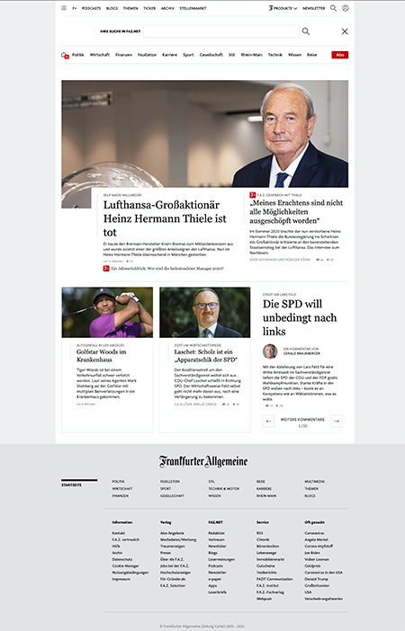
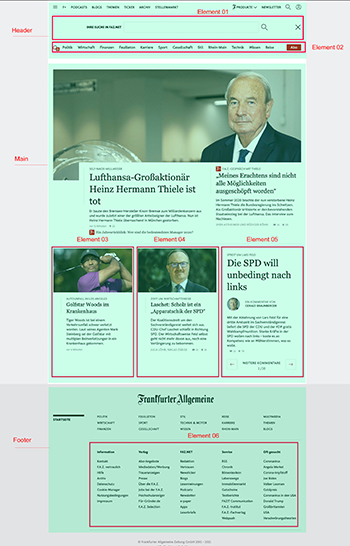

# brandung Frontend Assessment-Center 

Agenda:
1. Intro
2. Entwicklungsumgebung einrichten
3. Aufgabenstellung
   1. HMTL Aufbau (Semantik)
   2. CSS (Styling)
   3. JavaScript (*optional!*)
4. Hilfreiche Links


## 1. Intro
TBD

## 2. Entwicklungsumgebung einrichten
Bevor ihr mit der Umsetzung beginnt, müsst ihr ein paar Sachen vorbereiten.

1. Wenn auf eurem Rechner noch kein node.js und NPM installiert ist, müsst ihr dies nun nachholen. Auf folgender Seite könnt ihr das für euer Betriebsystem relevante Package runterladen und installieren: *https://nodejs.org/en/* (LTS Version)
   
2. Als nächstes das Repo herunterladen und das ZIP File auf eurer Festplatte entpacken:

   [Download Repo from Github](https://github.com/brandung/)
   
3. Öffnet einen Editor ([zum Beispiel Visual Studio Code](https://visualstudio.microsoft.com/de/)) und fügt den Ordner eurem Arbeitsbereich hinzu.
4. Im Terminal-Fenster des Editors müsst ihr nun die node packages für das Projekt mit folgendem Befehl installieren. 
   ```
    $ npm install
    ```

5. Nun könnt ihr mit dem Befehl `npm start` einen localen Server starten und die index.html im Browser über folgende URL aufrufen:
   ```
   http://localhost:8080/
   ```

## Aufgabenstellung
Die Augabe ist in drei Bereiche aufgeteilt: HTML, CSS und JS. Der Fokus sollte bei euch auf den ersten beiden Themen **HTML** und **CSS** liegen. Wer sich an der **JS** Aufgabe versuchen möchte, kann dieses gerne tun, ist aber keine Pflicht.

### Kommen wir nun (endlich) zur Aufgabenstellung
Eure Aufgabe wird es sein, eine News Seite der FAZ nachzubauen. Dabei geht es aber nicht um den kompletten 1:1 Nachbau, sondern um einzelne Elemente der Seite. Look & Feel eurer Umsetzung sollte sich aber an der Aufmachung der FAZ Webseite orientieren.

Im Ordner `./src/assets/` findet ihr die Datei: `ac-fe-task.jpg`.



Diese soll euch als Vorlage für die Umsetzung der News Seite dienen. 

Die Datei `ac-fe-task-explanation.jpg` zeigt euch die Elemente und HTML Struktur, die für die Lösung der Aufgabe relevant sind.




### HTML (Semantik)
Der HTML Part besteht darin, dass ihr die DOM Struktur der Seite erstellt. Angefangen von der Aufteilung des Header, Main und Footer Blocks (grüne Flächen) bis hin zu dem Aufbau der sechs Content-Elementen (rote Kästchen). Achtet hier auf eine gute Semantik. Dazu haben wir euch unten auch einen Link zum Nachschlagen angefügt.

Texte und Bilder könnt ihr gerne aus der Vorlage entnehmen. Es können aber auch Platzhalterbilder und Blindtexte verwendet werden.

Elemente und Blöcke die in der Grafik nicht markiert sind, können einfach als Plazhalter eingesetzt werden. Nutzt hier `<div></div>` Container ohne Inhalt.

### CSS (Layout / Styling)
Im zweiten Part geht es um das Styling der Seite. Auch hier wieder den Fokus auf die grün und rot markierten Blöcke und Elemente legen. 

Geht dabei am besten von aussen nach innen vor. Also erst den Aufbau der Container und dann die einzelnen Elemente. 

Wir erwarten nicht, dass ihr das Layout 1:1 nachbaut. Versucht einen guten Mittelweg zu finden. In der Aufgabe geht es darum, dass ihr uns zeigt, wie ihr euer Stylesheet aufbaut und ihr an die Sache generell herangeht.

### JS (*optional*)
Der dritte Part beschäftigt sich mit einem kleinen Javascript Modul. Dieser ist wie gesagt freiwillig!

Das Element `06` beinhaltet einen kleinen *Slider*. Hier können die News-Teaser über die Pfeil-Buttons hin- und hergescrollt werden.

## Hilfreiche Links
- [Struktur in die Website bringen](https://developer.mozilla.org/de/docs/Learn/HTML/Einf%C3%BChrung_in_HTML/Document_and_website_structure#aktives_lernen_den_code_aus_dem_beispiel_verstehen)
- [CSS Grundlagen](https://developer.mozilla.org/de/docs/Learn/Getting_started_with_the_web/CSS_basics)
- [wiki.selfhtml.org](https://wiki.selfhtml.org/wiki/Startseite)
- [W3C.org](https://www.w3.org/)
